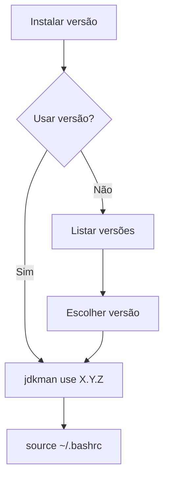

# JDKMAN - Java Development Kit Manager

**Gerencie múltiplas versões do JDK no Debian/AlmaLinux**  
Uma ferramenta intuitiva para instalar, alternar e remover versões do Java Development Kit sem conflitos.

## 🎯 Objetivo
Facilitar a instalação e gerenciamento de múltiplas versões do JDK em sistemas baseados em Debian/AlmaLinux, permitindo que desenvolvedores alternem entre versões conforme necessário para diferentes projetos Java.

## ⚙️ Requisitos do sistema
- **Sistema Operacional**: Debian 12 (Bookworm) ou AlmaLinux 9.6
- **Dependências**:
  - `wget` - Para download de arquivos
  - `tar` - Para extração de pacotes
  - `gzip` - Para descompressão de arquivos
  - `bash` - Shell para execução dos scripts
- **Permissões**: Execução como usuário comum (não requer root)

---

## 📦 Como instalar o jdkman?

**No terminal com sua conta de usuário comum execute:**

```bash
wget -qO- https://raw.githubusercontent.com/souza-lb/jdkman/main/install | bash
```

Após a instalação, **reinicie seu terminal** ou execute:
```bash
source ~/.bashrc
```

--- 

## 📋 Comandos disponíveis

### ℹ️ Exibir ajuda
```bash
jdkman help
```

### 🔍 Listar versões instaladas
```bash
jdkman list
```

Exemplo de saída:
```
Versões JDK disponíveis:
    11.0.22
--> 17.0.10
    21.0.3
```

### ⬇️ Instalar uma versão
```bash
jdkman install [URL/arquivo]
```

**Exemplos:**
```bash
# Instalar via URL oficial (OpenJDK)
jdkman install https://download.java.net/java/GA/jdk21.0.3/6f051398cb9c4f8e9a31b7e5a811af52/jdk-21.0.3_linux-x64_bin.tar.gz

# Instalar arquivo local
jdkman install ~/Downloads/jdk-17.0.10_linux-x64_bin.tar.gz
```

### ⚡ Ativar uma versão
```bash
jdkman use [versão]
```

**Exemplo:**
```bash
jdkman use 21.0.3
```

Saída:
```
Versão 21.0.3 definida como padrão!
Execute 'source ~/.bashrc' para aplicar as mudanças!
```

### 🔌 Desativar versão atual
```bash
jdkman disable
```

Saída:
```
JDK desativado com sucesso!
Execute 'source ~/.bashrc' para aplicar as alterações!
```

### 🗑️ Remover uma versão
```bash
jdkman remove [versão]
```

**Exemplo:**
```bash
jdkman remove 11.0.22
```

Saída com confirmações:
```
Deseja realmente remover a versão 11.0.22? [s/N]: s
Digite o número da versão para confirmar a remoção: 11.0.22
Removendo versao: 11.0.22...
Versão 11.0.22 removida com sucesso!
Execute 'source ~/.bashrc' para aplicar as mudanças!
```

---

## ⚙️ Estrutura de arquivos
O jdkman organiza os arquivos em:
```
~/.jdkman/
├── jdk_versions/      # Versões instaladas
│   ├── 17.0.10/
│   ├── 21.0.3/
│   └── current -> 17.0.10  # Link simbólico
└── jdk_env            # Configuração de ambiente
```

## 🔄 Pós-instalação
Após usar `use` ou `disable`, sempre execute:
```bash
source ~/.bashrc
```
Para aplicar as mudanças no ambiente atual.

---

## ❌ Mensagens de erro comuns
1. **Versão já instalada:**
   ```
   Erro: A versão '17.0.10' já está instalada!
   ```

2. **Remover versão em uso:**
   ```
   Erro: A versão '17.0.10' está em uso!
   Execute: 'jdkman disable' antes de tentar remover esta versão!
   ```

3. **Versão não encontrada:**
   ```
   Erro: Versão 11.0.22 não encontrada!
   ```

4. **Formato de versão inválido:**
   ```
   Erro: Formato inválido! Use X.Y.Z
   ```

---

## 🔄 Fluxo de trabalho típico



Passos detalhados:
1. **Instalar uma nova versão do JDK**: `jdkman install [URL]`
2. **Decidir se deseja usar a versão imediatamente**:
   - Se sim: ativar a versão com `jdkman use X.Y.Z`
   - Se não: listar versões com `jdkman list`
3. **Para listagem de versões**:
   - Escolher uma versão específica
   - Ativar com `jdkman use X.Y.Z`
4. **Sempre após ativar/desativar**: `source ~/.bashrc`
5. **Compilar e executar projetos Java**
6. **Quando necessário**:
   - Desativar versão atual: `jdkman disable`
   - Remover versões antigas: `jdkman remove [versão]`

---

## 🗑️ Como desinstalar?

**No terminal com sua conta de usuário comum execute:**

```bash
wget -qO- https://raw.githubusercontent.com/souza-lb/jdkman/main/uninstall | bash
```

---

## ❤️ Apoie o Projeto

**Dúvidas, sugestões e contribuições?**  
Leonardo Bruno  
souzalb@proton.me  

**Gostou do projeto e quer realizar uma contribuição voluntária?**  
*(Pode ser o valor de uma xícara de café ou chá...) ☕ 🍵*  

Chave PIX:  
`8dcc7e3c-0c6a-4c6f-a4c0-26a5e62686db`  

Ou utilize o QR Code abaixo:  

<p align="center">
  
</p>

**Você também pode utilizar o PayPal:**  

[](https://www.paypal.com/donate/?hosted_button_id=EQVW5QQ7GBGSY)

<p align="center">
  
</p>

**A utilização deste projeto é livre para alterações e adaptações**  
*Desde que feita a devida referência ao repositório original e seu criador.*
